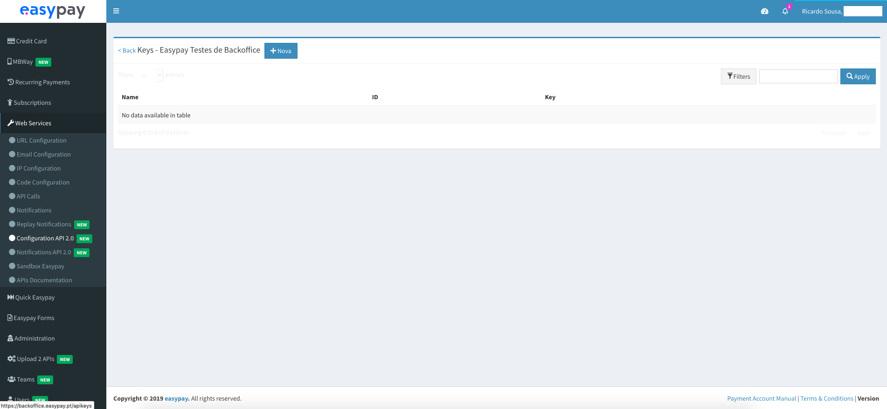
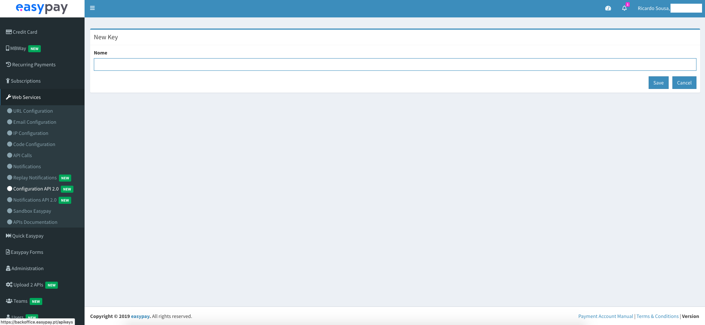
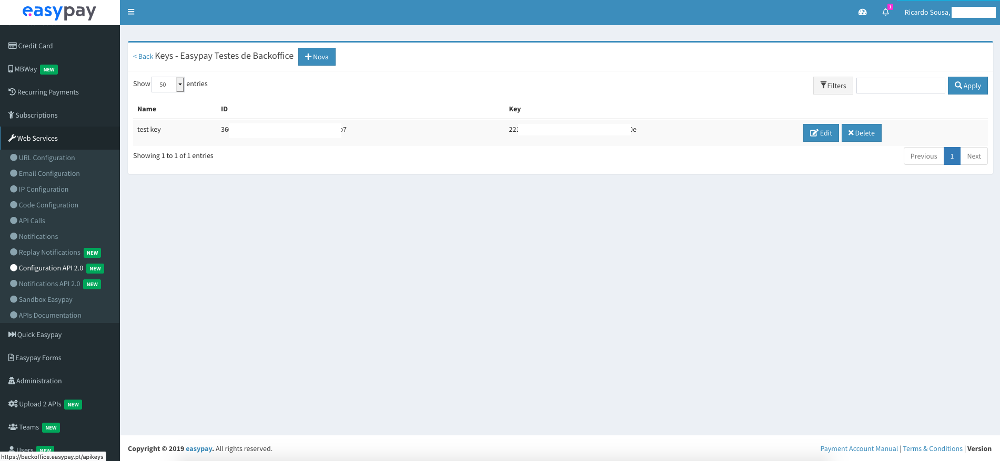
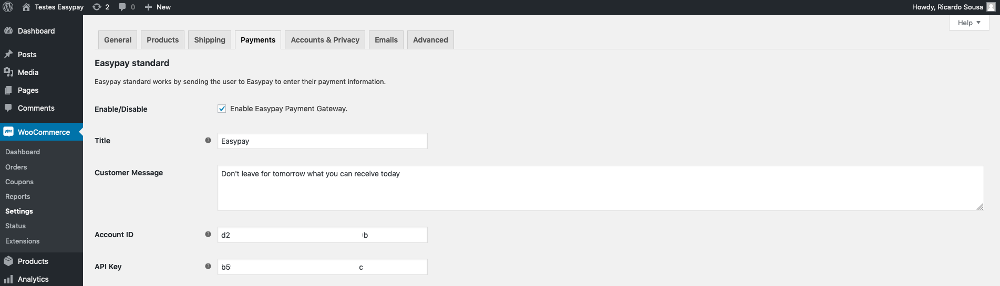
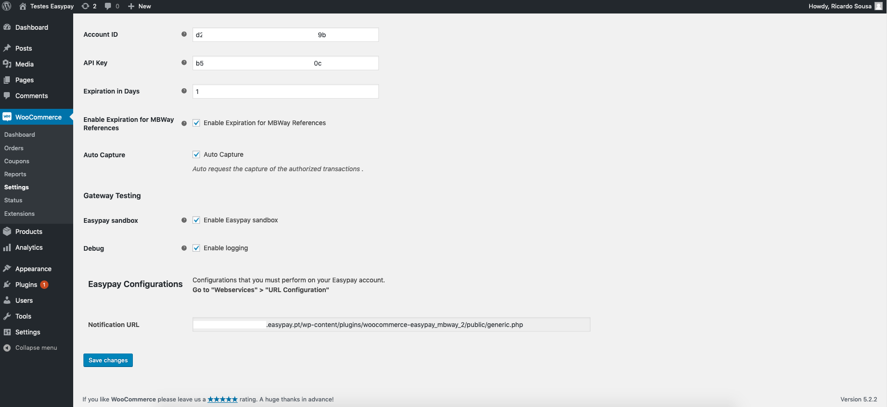
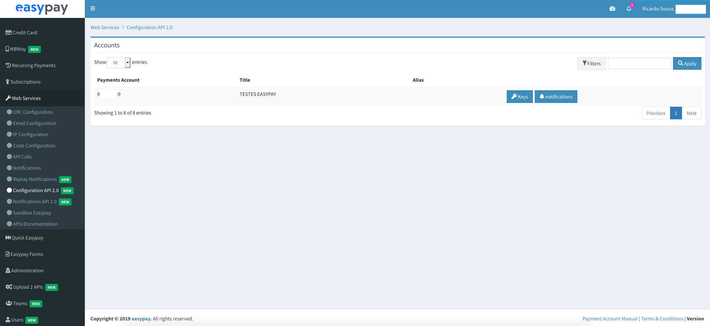
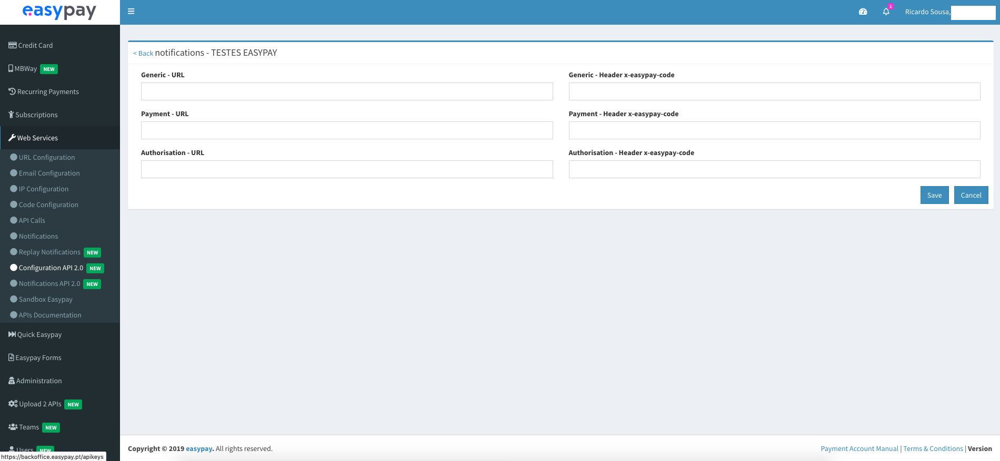

# Easypay WooCommerce plugins 
These plugins serve as middleware between your shop and easypay’s online payment services (APIs). You may have one or more plugins installed, depending on your contract with easypay.
You can even test easypay’s online payment services with these plugins before going into production.

# Available payment method plugins
- Credit Card (single payment only)
- Multibanco
- MBWay

# How it works
## In general 
Your clients checkout their order and pay you using Credit Card / Multibanco / MBWay through easypay’s payment plugin. 

Once the payment process is completed easypay’s online services notify the plugin and you can verify it on easypay’s Backoffice or on your own system.

## In particular
### WooCommerce Easypay MBWay
This plugin allows for MBWay order payment at your shop using easypay as a payment provider and the MBWay app installed on the customer’s cellphone. 

When your customer checks out he / she will receive an notification on they’re MBWay app that you wish to charge they’re account with the order value. 

The plugin waits for 5 minutes for the customer’s OK or NOT OK. When the customer allows the transaction the plugin tries to get the funs from the customer if automatic capture is configured, if not you may do it on easypay’s Backoffice. 

If the 5 minutes are over and the customer does nothing the order and authorisation are automatically canceled. 

## Before installing the plugin...
You **must** uninstall previous versions of the plugin. We strongly recommend against having older versions of the plugin installed simultaneously.

You **must** have an easypay payments account - [sandbox](https://backoffice.test.easypay.pt/login) or [production](https://backoffice.easypay.pt/login) - with the desired payment method activated by your easypay business manager.

After you have your account activated you must go to _WebServices_ > _Configuration API 2.0_ > _[Your payments account]_ > _Keys_ > _New_ (button), name your key and save it. You will be redirected back and the table will show the Account ID and API Key. You will need this in your plugin. Check the images below.  

> Table that show available Account ID and API Key pairs

> Name the new Account ID and API Key pair that the system will create

> Your new Account ID and API Key pair to configure/use in the plugin

## Plugin installation
- Download the plugin installation zip file available at [easypay's downloads page](https://docs.easypay.pt/download)
- Install the zipped folder with the Wordpress buit-in plugin installation tool **OR** unzip the plugin and copy as a folder to the plugins dir, making sure the web server can read the plugin files directory (555) and files (444)
- Activate the plugin in the plugins list. The plugin is named _Easypay MBWay_

__Note__: It is required to have WooCommerce previously installed.

## Plugin configuration
All plugins require an **Account ID** and **API Key**. You did this before in **Before installing the plugin...**

> Place your new Account ID and API Key pair in the plugin

### Easypay Sandbox
Check this box if you to use easypay’s sandbox (test mode). 

__Note__: If using sandbox mode the Account ID and API Key must be generated in easypay’s Sandbox Backoffice (https://backoffice.test.easypay.pt).  Production key and id will not work in sandbox mode and vice-versa.

__Note__: No real money is used when this is enabled! Use this for testing purposes only.

### Debug
Check this box if you to use log actions into a log file in your system. Depending on your WooCommerce configuration you may find these files in the plugins directory - /uploads/wc-logs/ - there is a file for errors and another for actions logged by the plugin. These log files rotate so expected it to be suffixed with a date and alpha-numeric hash.

## The following configurations are plugin specific:
### WooCommerce Easypay MBWay
#### Expiration in Days 
Set how many days you want the payment to be payable. After that that date your customer won’t be available. 

The order is not automatically cancelled when this time is over, that is up to you to decide.

#### Enable Expiration for MBWay References 
Check this box to enforce payment expiration. Your customer won’t be able to pay after the set number of days 

#### Auto capture
Check this box if you want the funds to be captured automatically after payment authorisation.

#### Notification URL
This is the URL in your system that easypay will use to communicate with the plugin, to communicate payment status or other operations. 

> Notification URL to copy&paste into backoffice

Copy&paste this url into easypay's Backoffice web services configuration, _WebServices_ > _Configuration 2.0_ > _[Your payments account]_ > _Notifications_ > _Generic - URL_

> Your payments account to be configured in backoffice

> Paste notification URL here

## Final Notes
We strongly recommend against having older versions of the plugin installed at the same time. We recommend you uninstall older version and only use this new one.

If you'd like to understand how the plugin uses easypay's payment APIs you can read our online docs available at https://api.prod.easypay.pt/docs